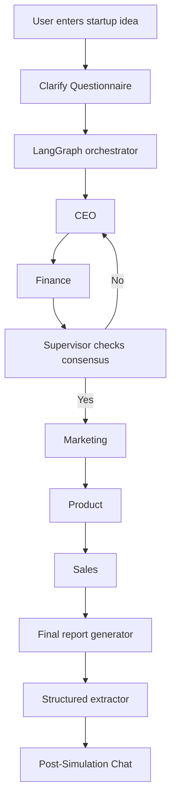

# MASS — Multi-Agent Startup Simulator

<p align="center">
    <strong>One idea in. A full startup plan out.</strong>
</p>

<p align="center">
    <a href="https://www.python.org/"></a>
    <a href="https://www.langchain.com/langgraph"></a>
    <a href="https://groq.com/"></a>
    <a href="https://fastapi.tiangolo.com/"></a>
    <a href="https://nextjs.org/"></a>
    <a href="./LICENSE"></a>
    <a href="https://mass-sim.vercel.app/"></a>
</p>

---

## 🚀 Live Demo

Try the simulator right now at: **[mass-sim.vercel.app](https://mass-sim.vercel.app/)**

---

## ✨ Overview

MASS is a multi-agent startup simulator that turns a single business idea into a structured founder-style debate. Instead of generating a one-shot answer, it runs the idea through specialized AI agents — CEO, Finance, Marketing, Product, Sales — and a Supervisor that checks whether the team has actually reached workable consensus.

The result is a practical startup brief covering the mission, problem statement, target customer, business model, financial snapshot, go-to-market plan, MVP scope, revenue targets, key conflicts, and a final verdict.

The project ships with a **Python backend** (LangGraph + FastAPI) for the multi-agent orchestration and a **Next.js frontend** with a terminal-inspired dark UI where users can submit ideas, watch agents debate in real time via **Server-Sent Events (SSE)**, interact with the council post-simulation, and view structured results.

---

## 🚀 What It Does

### Pre-Simulation Clarification
- You enter your startup idea, and the AI generates 3 dynamic, multiple-choice questions to pinpoint your target market, constraints, and revenue model before the simulation even begins.

### Multi-agent debate loop
- CEO proposes the startup direction and initial strategy.
- Finance pushes back on pricing, burn, runway, and feasibility.
- Supervisor checks whether CEO and Finance have reached a usable agreement.
- Marketing, Product, and Sales then refine the plan from their own perspectives.
- The final report reflects the negotiated output, not just a single model response.

### Post-Simulation Chat (Pro Feature)
- Once the report is generated, you can chat directly with the entire agent council.
- Ask general questions, or target specific agents (e.g., "@Finance why is the CAC so high?") to get brutally honest, persona-driven answers based on your generated plan.

### Structured output
- Generates a readable business report.
- Extracts a validated structured business plan (Pydantic models).
- Persists outputs to the `outputs/` directory as JSON, TXT, and structured plan files.

### Web interface
- Terminal-inspired dark landing page with agent council visualization.
- Simulation flow that collects startup idea, runs the clarification questionnaire, and then starts the simulation.
- **Real-time SSE streaming** — the UI syncs with the backend so the agent grid highlights only the agent that's actually running.
- **Live activity feed** — shows each agent's summary, supervisor consensus verdicts (agreed / not agreed / forced after 3 rounds), debate loop transitions, and round numbers.
- Structured results displayed in styled cards — pricing tiers, financial snapshot, revenue targets, and more.
- **Comprehensive Documentation & Legal Pages** — included `/docs`, `/privacy`, and `/terms` directly integrated into the app.
- **Vercel Analytics** integrated for privacy-friendly tracking.

### API
- FastAPI endpoints for programmatic use.
- Background job processing with status polling.
- **SSE streaming endpoint** for real-time agent activity events.
- CORS-enabled for frontend integration.

---

## 🧠 How It Works



All agents read from and write to one shared state object. That keeps the workflow deterministic enough to inspect, while still allowing the LLMs to debate and revise their positions.

---

## 📦 Key Features

- **Blazing Fast Inference:** Powered by Groq's LPU inference engine running the Llama 3.3 70B Versatile model.
- **Dynamic Business Context:** The system roots all strategy in Y-Combinator / Lean Startup frameworks. Constraints like "bootstrapped vs venture-backed" strictly dictate the generated plans, and currencies automatically adapt based on your market.
- **Role-separated agents:** each agent has a distinct business lens and reasoning persona.
- **Consensus gating:** the supervisor decides whether CEO and Finance need another round.
- **Conflict capture:** disagreements are recorded instead of being silently overwritten.
- **Structured extraction:** the final report is converted into a typed business-plan object with retry-on-validation-failure.
- **Interactive Council Chat:** Chat with the specific agents that built your plan after it's finished.
- **Web UI:** Terminal-inspired Next.js frontend with live streaming, a one-time free demo flow, and an authenticated modern dashboard.
- **SaaS Ready:** Full Supabase Authentication, Row Level Security (RLS) data isolation, and dynamic paywalls.

---

## 🛠️ Tech Stack

| Layer | Tool |
|---|---|
| Agent orchestration | LangGraph state machine |
| LLM access | Groq API (Llama 3.3 70B) |
| Backend | Python + FastAPI |
| Real-time streaming | Server-Sent Events (SSE) |
| Frontend | Next.js 16, Tailwind CSS v4, TypeScript |
| Shared state | TypedDict |
| Structured output | Pydantic models |

---

## 🧩 Project Structure

```text
MASS/
├── agents/
│   ├── ceo_agent.py          # Steve Jobs + Elon Musk reasoning persona
│   ├── finance_agent.py      # Naval Ravikant reasoning persona
│   ├── marketing_agent.py    # Alex Hormozi reasoning persona
│   ├── product_agent.py      # Brian Chesky (Airbnb) reasoning persona
│   ├── sales_agent.py        # Jason Lemkin (SaaStr) reasoning persona
│   ├── supervisor_agent.py   # Consensus evaluator
│   ├── context_block.py      # Dynamic lean startup/YC constraints
│   └── llm_router.py         # Handles free/pro tier model routing (Groq)
├── mass-frontend/
│   ├── src/
│   │   ├── app/
│   │   │   ├── globals.css             # Tailwind v4 theme + design tokens
│   │   │   ├── layout.tsx              # Root layout with fonts
│   │   │   ├── page.tsx                # Landing page route
│   │   │   ├── simulate/page.tsx       # Intake, Clarify, and Live SSE flow
│   │   │   ├── dashboard/[id]/page.tsx # Pro Chat & History dashboard
│   │   │   └── login/page.tsx          # Authentication
│   │   ├── components/                 # UI components
│   │   ├── lib/api.ts                  # FastAPI endpoints + SSE stream client
│   │   └── types/simulation.ts         # TypeScript types
│   ├── package.json
│   └── tsconfig.json
├── api.py                    # FastAPI endpoints + SSE streaming
├── event_bus.py              # In-memory pub/sub for real-time events
├── graph_orchestrator.py     # LangGraph state machine + event emission
├── job_store.py              # In-memory job tracking
├── main.py                   # CLI entry point
├── models.py                 # Pydantic business plan models
├── report_generator.py       # Final report synthesis
├── save_report.py            # JSON/TXT persistence
├── state.py                  # Shared StartupState definition
├── structured_extractor.py   # LLM → structured JSON extraction
└── requirements.txt
```

---

## ⚙️ Getting Started

### Prerequisites
- Python 3.10+
- Node.js 18+
- A Groq API key

### Backend setup

```bash
git clone https://github.com/mayankmalik263/Mass-Multi-Agent-STARTUP-Simulator-.git
cd MASS

python -m venv venv
venv\Scripts\activate

pip install -r requirements.txt

copy .env.example .env
# Add your GROQ_API_KEY to .env
```

### Frontend setup

```bash
cd mass-frontend
npm install
```

### Running the app

```bash
# Terminal 1 — Start the API server
uvicorn api:app --reload

# Terminal 2 — Start the frontend
cd mass-frontend
npm run dev
```

Then open [http://localhost:3000](http://localhost:3000) in your browser.

---

## 🌐 API

The FastAPI service in [api.py](api.py) exposes the following endpoints:

| Method | Endpoint | Description |
|---|---|---|
| `GET` | `/` | Service health check |
| `POST` | `/clarify` | Takes a raw idea and returns 3 multiple-choice questions |
| `POST` | `/simulate` | Start a new simulation (returns `job_id`) |
| `GET` | `/simulate/{job_id}` | Poll job status and fetch results |
| `GET` | `/simulate/{job_id}/stream` | SSE stream of real-time agent activity events |
| `POST` | `/simulate/{job_id}/chat` | Ask follow-up questions to the generated council |
| `GET` | `/simulations` | List user's past simulations (Supabase Auth required) |

---

## 💡 Why This Project Matters To Me

I built MASS because I kept running into the same frustration: people love saying, "build a startup," but they rarely explain what happens after the idea.

As a student, I do not have a CEO, a product manager, a finance advisor, or a marketing team sitting next to me. I had access to great general-purpose AI tools, but I wanted something that felt more specific to startup thinking, something that could challenge ideas instead of just generating them.

That is what led me to build MASS. I wanted a system where five different AI agents could act like a founding team, debate a startup idea from different angles, and force each other toward a realistic decision. What started as a side project became a deeper learning experience about system design, LangGraph, shared state, disagreement handling, and how to keep multiple LLMs from drifting into different realities.

The best part is that I ended up building something I genuinely wanted for myself. At the same time, I got to go deeper into multi-agent architecture in a way that felt practical, not theoretical.

---

## 🔭 Future Improvements

- Add a stronger evaluation framework to measure output quality and consistency across runs.
- ~~Add follow-up Q&A capability with the agent council~~ ✅ Done — Added Pro Chat interface (June 23, 2026).
- ~~Migrate to faster inference for real-time agent execution~~ ✅ Done — Migrated to Groq with Llama 3.3 70B (June 23, 2026).
- ~~Tighten structured validation across agent outputs so the final plan is more reliable.~~ ✅ Done — Added strict validation and retry logic (June 22, 2026).
- ~~Build a history layer so simulation runs can be compared, replayed, and reused.~~ ✅ Done — Integrated Supabase database (June 22, 2026).
- ~~Add authentication so users can save and revisit their simulation results.~~ ✅ Done — Added Supabase Auth, Row Level Security, Free Demo Mode, and Dashboard UI (June 22, 2026).
- ~~Add real-time streaming so agent outputs appear as they are generated instead of polling.~~ ✅ Done — SSE streaming implemented (June 19, 2026).

---

## 📄 License

This project is licensed under the MIT License. See the [LICENSE](LICENSE) file for details.

---

## 👤 Ownership

Original work belongs to Mayank Malik. AI tools were used as a productivity aid, but the architecture, agent boundaries, debate flow, and state design were developed manually.