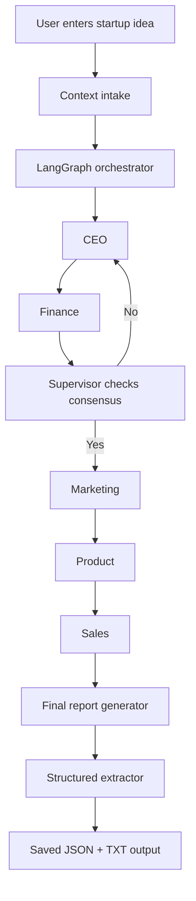

# MASS — Multi-Agent Startup Simulator

<p align="center">
    <strong>One idea in. A full startup plan out.</strong>
</p>

<p align="center">
    <a href="https://www.python.org/"></a>
    <a href="https://www.langchain.com/langgraph"></a>
    <a href="https://openrouter.ai/"></a>
    <a href="https://fastapi.tiangolo.com/"></a>
    <a href="./LICENSE"></a>
</p>

---

## ✨ Overview

MASS is a Python-based multi-agent startup simulator that turns a single business idea into a structured founder-style debate. Instead of generating a one-shot answer, it runs the idea through specialized agents for CEO, Finance, Marketing, Product, Sales, and a Supervisor that checks whether the team has actually reached workable consensus.

The result is a practical startup brief saved as JSON and plain text, covering the mission, problem statement, target customer, business model, financial snapshot, go-to-market plan, MVP scope, revenue targets, conflicts, and final verdict.

This project is intentionally more than a prompt wrapper. It uses a LangGraph state machine, shared state, conflict tracking, structured extraction, and a FastAPI layer so the architecture feels closer to a real AI product workflow.

---

## 🚀 What It Does

### Multi-agent debate loop
- CEO proposes the startup direction and initial strategy.
- Finance pushes back on pricing, burn, runway, and feasibility.
- Supervisor checks whether CEO and Finance have reached a usable agreement.
- Marketing, Product, and Sales then refine the plan from their own perspectives.
- The final report reflects the negotiated output, not just a single model response.

### Structured output
- Generates a readable business report.
- Extracts a validated structured business plan.
- Persists outputs to the `outputs/` directory as JSON, TXT, and structured plan files.

### Product-style interface
- CLI entry point for quick simulation runs.
- FastAPI endpoint for programmatic use.
- Ready for a future frontend or workflow dashboard.

---

## 🧠 How It Works



All agents read from and write to one shared state object. That keeps the workflow deterministic enough to inspect, while still allowing the LLMs to debate and revise their positions.

---

## 📦 Key Features

- **Role-separated agents:** each function has a distinct business lens.
- **Consensus gating:** the supervisor decides whether CEO and Finance need another round.
- **Conflict capture:** disagreements are recorded instead of being silently overwritten.
- **Context-aware prompting:** user inputs like target audience, market, revenue model, and constraints influence outputs.
- **Structured extraction:** the final report is converted into a typed business-plan object.
- **API-ready design:** the FastAPI layer exposes the simulator for external clients.

---

## 🛠️ Tech Stack

| Layer | Tool |
|---|---|
| Orchestration | LangGraph state machine |
| LLM access | OpenRouter |
| Backend | Python |
| Shared state | TypedDict |
| API | FastAPI |
| Output | JSON, TXT, structured plan |

---

## 🧩 Project Structure

```text
MASS/
├── agents/
│   ├── ceo_agent.py
│   ├── finance_agent.py
│   ├── marketing_agent.py
│   ├── product_agent.py
│   ├── sales_agent.py
│   └── supervisor_agent.py
├── api.py
├── graph_orchestrator.py
├── intake.py
├── job_store.py
├── main.py
├── models.py
├── report_generator.py
├── save_report.py
├── state.py
├── structured_extractor.py
├── outputs/
└── requirements.txt
```

---

## ⚙️ Getting Started

### Prerequisites
- Python 3.10+
- An OpenRouter API key

### Setup

```bash
git clone https://github.com/mayankmalik263/MASS.git
cd MASS

python -m venv venv
venv\Scripts\activate

pip install -r requirements.txt

copy .env.example .env
# Add your OPENROUTER_API_KEY to .env

python main.py
```

### CLI flow

```bash
python main.py
```

Then enter your startup idea and optional context details when prompted.

---

## 🌐 API

The project also includes a FastAPI service in [api.py](api.py).

### Endpoints
- `GET /` returns basic service status.
- `POST /simulate` starts a background simulation.
- `GET /simulate/{job_id}` fetches job status and results.

This makes it easy to connect the simulator to a frontend, dashboard, or internal tool.

---

## 📈 Why This Project Stands Out

For a third-year student project, MASS is stronger than a typical CRUD app or generic AI wrapper because it shows systems thinking. It demonstrates orchestration, shared state, prompt design, structured output, and a real attempt at productizing the idea.

The most valuable part is not just that it uses AI. It shows how multiple specialized agents can collaborate, disagree, and converge on a decision. That is a relevant pattern in the current AI market, and it is exactly the kind of thing recruiters notice when they want to see more than a tutorial clone.

---

## 🔭 Roadmap

- Add stricter Pydantic validation across agent outputs.
- Improve evaluation and reliability with test coverage.
- Build a frontend for live agent visibility.
- Add richer analytics and simulation history.
- Make the structured plan easier to query and compare across runs.

---

## 📄 License

This project is licensed under the MIT License. See the [LICENSE](LICENSE) file for details.

---

## 👤 Ownership

Original work belongs to Mayank Malik. AI tools were used as a productivity aid, but the architecture, agent boundaries, debate flow, and state design were developed manually.